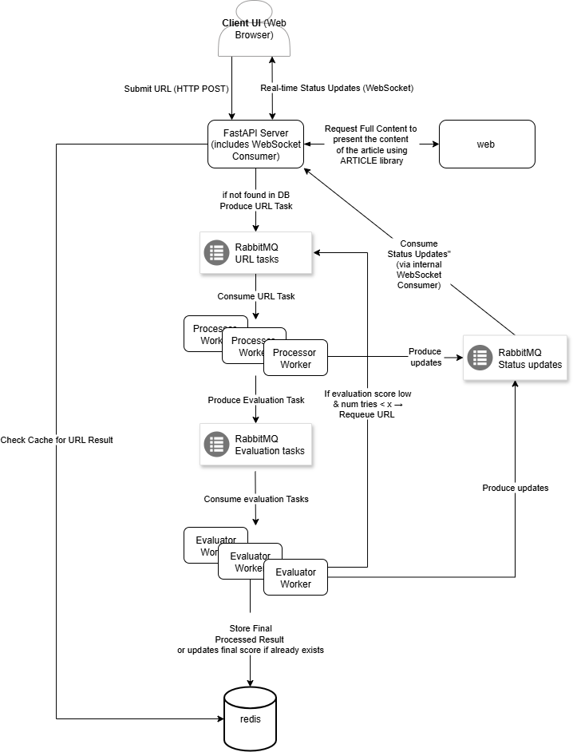

# Content Filtering and Summarization System

This project implements a **distributed content processing pipeline** designed to ingest URLs, extract and summarize their content using Large Language Models (LLMs), evaluate the quality of the output, and provide real-time status updates to clients.

---
## System design diagram

Diagram Note: The diagram depicts multiple workers to illustrate the system's scalable architecture.

## Core Architecture Overview

The system is built around several decoupled components that communicate asynchronously, primarily utilizing **RabbitMQ for robust message queuing** and **Redis for high-speed caching and persistent data storage**, with **FastAPI as the primary API and WebSocket server**.

Here's a high-level look at the main components:

### 1. **FastAPI Server (`main.py`)**

* **Your Gateway to the System**: This is the main entry point for users, implemented as a web API using FastAPI.
* **URL Submission Flow**:
    * Clients send URLs to this server.
    * The server first checks **Redis** for a cached result.
        * **If Cached**: It immediately sends the cached result back to the client via **WebSocket** and marks the URL as "cached."
        * **If Not Cached**: It places the URL into a **RabbitMQ queue (`url_tasks`)** for asynchronous processing and sends a "queued" status update via **WebSocket**.
* **Real-time Updates (WebSockets)**: Provides a WebSocket endpoint (`/ws/{request_id}`) allowing clients to receive live status updates (e.g., "queued", "processing", "completed", "failed") as their submitted URLs move through the pipeline.
* **Domain Filtering**: Ensures only URLs from a predefined list of allowed domains (configured in `config.py`) are accepted, rejecting others early.
* **On-Demand Full Content Fetching**: The server provides an API endpoint (`/api/content`) that the client can call to fetch the *full article content* of a given URL. This is specifically for display purposes on the client-side; the full content is not stored in the database.

---

### 2. **Processor Workers (`llm_workers/processor/`)**

* **The Content Extractor & Initial LLM Analyzer**: These workers continuously listen to the `url_tasks` queue in **RabbitMQ**.
* **Asynchronous Processing for LLM Operations**: Initially, a synchronous RabbitMQ client (`pika`) was used. However, due to the inherent latency of LLM responses, a synchronous approach led to connection timeouts and disconnections while waiting for LLM results. To resolve this, the system was re-architected to use an **asynchronous RabbitMQ client (`aio-pika`)**. This ensures that the worker can continue to process other messages or manage its connection while awaiting LLM responses, preventing disconnections and enabling efficient concurrent operations.
* **How it Works**:
    1.  Pulls a URL from the queue.
    2.  Fetches the article's text using the `newspaper` library.
    3.  **Efficient Summarization with LLMs**:
        * For potentially long articles, the text is broken down into smaller **chunks** using LangChain's text splitters.
        * These chunks are then sent to a configured **Large Language Model (LLM)** (e.g., Groq, OpenAI, Gemini, Claude) using LangChain's built-in **MapReduce summarization technique**. This means each chunk is summarized individually ("Map" phase), and then these mini-summaries are combined into a concise final **summary** ("Reduce" phase). This approach effectively handles large inputs while staying within LLM token limits.
    4.  From the generated summary, the LLM then extracts **keywords** and determines the **sentiment** of the content, also orchestrated via LangChain.
    5.  Once processed, it places the result into another **RabbitMQ queue (`evaluation_tasks`)** for quality checking.
    6.  Sends real-time status updates ("processing", "processed") via **WebSockets**.
* **Robustness**: Includes built-in retry logic for failed processing attempts.

---

### 3. **Evaluator Workers (`llm_workers/evaluator/`)**

* **The Quality Control & Decision Maker**: These workers listen to the `evaluation_tasks` queue.
* **LLM-Powered Quality Assessment**: Takes the **summary, keywords, and sentiment** generated by the Processor and sends them to an **LLM** for a detailed quality evaluation. **Crucially, the evaluation is performed on the concise summary and derived data, rather than the full, potentially large article content, to optimize LLM token usage and processing costs.** It assigns scores for:
    * Summary Quality
    * Keyword Relevance
    * Sentiment Alignment
* **Prompt Engineering for Accuracy**: The prompts used for these evaluations were carefully crafted and iteratively refined to ensure the LLM provides accurate, consistent, and helpful assessments, which was a key part of achieving reliable quality control. All LLM interactions for evaluation are orchestrated using LangChain's powerful chaining capabilities.
* **Decision Logic**:
    * Calculates an `overall_score`.
    * **If `overall_score` is high enough (above a configurable threshold)**: The processing is considered **`completed`**. The final result is **stored in Redis** for future caching, and a "completed" status update is sent via **WebSocket**.
    * **If `overall_score` is too low**: The URL is **re-queued back to `url_tasks`** for another processing attempt, creating a feedback loop for continuous improvement.
* **Persistence**: Only the *analyzed results* (summary, keywords, sentiment, score) are saved to **Redis**, not the full article content itself.
* Sends real-time status updates ("evaluating", "completed", "reprocessing") via **WebSockets**.

---

### 4. **Messaging System (RabbitMQ)**

* **The Backbone of Asynchronous Communication**: RabbitMQ acts as a highly reliable message broker, decoupling the components. All communication with RabbitMQ is handled asynchronously, allowing for efficient, non-blocking operations crucial for distributed processing.
* **Key Queues**:
    * `url_tasks`: For URLs awaiting initial content processing.
    * `evaluation_tasks`: For processed URLs awaiting quality evaluation.
    * `status_updates`: A dedicated queue where all components publish real-time status changes. This queue is actively maintained to ensure all status updates are reliably delivered to the WebSocket consumer for client display.
* **Robustness & Durability**: Queues are configured to be **durable**, meaning messages persist on disk even if the RabbitMQ server restarts, preventing data loss.

---

### 5. **Data Storage & Caching (Redis)**

* **High-Speed Cache and Persistent Result Store**: Redis is used for two primary functions, leveraging its versatility and persistence features:
    * **Persistent Caching of Processed Results with RedisJSON**: The system stores the `URLProcessingResult` (summary, keywords, sentiment, overall score) of successfully processed URLs directly as **JSON objects within Redis**. This provides efficient caching and fast retrieval of structured data produced by the LLMs. Crucially, Redis is configured for **persistence (e.g., AOF or RDB snapshotting)**, ensuring that cached results are not lost even if the Redis server restarts. The choice of **Redis version 8 or higher** is specifically for its enhanced native JSON data type support.
    * **Fast Lookups**: Enables quick checks for cached results before new tasks are queued.

---

### 6. **Configuration (`app/common/config.py`)**

* **Centralized Settings**: All environment-dependent settings (e.g., RabbitMQ credentials, Redis host, LLM API keys) are managed here, typically loaded from `.env` files.
* **LLM Flexibility**: Provides a smart function (`get_llm()`) to dynamically instantiate and use different **LLM providers** (Groq, OpenAI, Gemini, Anthropic) based on configuration, making it easy to swap models.
* **System Parameters**: Defines crucial operational parameters like allowed domains for URL submissions, retry limits for tasks, and the evaluation score threshold that determines content quality.

---

### 7. **Data Models (`app/common/models.py`)**

* **Ensuring Data Consistency**: This module defines **Pydantic models** (e.g., `URLProcessingResult`, `EvaluationScores`) that standardize the structure of data as it flows between different components and is stored in Redis. This ensures clear, validated data communication throughout the pipeline.

---

### 8. **Client-Side UI (`static/index.html`)**

* **Interactive Frontend**: This simple HTML page, powered by JavaScript, provides a user interface to interact with the backend system.
* **URL Submission**: Users can input a URL, and the JavaScript sends it to the FastAPI server's `/api/submit` endpoint.
* **Real-time Feedback**: The client dynamically opens a **WebSocket connection** (`/ws/{request_id}`) for each submitted URL's unique request ID. It then displays live status updates as they are received from the backend (e.g., "queued," "processing," "evaluating," "completed," "failed"), along with detailed logs.
* **Result Display**: When a URL's processing is "completed" or a "cached" result is returned, the client updates the UI to show the generated summary, keywords, sentiment, and overall score.
* **Full Content Display**: If a result is available, the client automatically makes an additional fetch request to `/api/content` to retrieve and display the full article text, demonstrating the server's on-demand content fetching capability.

---

### 9. **Key Technologies & Libraries**

* **LangChain**: This project heavily leverages the **LangChain framework** to streamline interactions with Large Language Models. LangChain provides powerful abstractions and pre-built functionalities that were instrumental in development, including:
    * **Web Content Loading**: While `newspaper` handles initial fetching, LangChain's `WebBaseLoader` (or similar) can abstract parts of web content extraction.
    * **Text Splitting**: Efficiently breaking down long articles into manageable chunks using `RecursiveCharacterTextSplitter`.
    * **MapReduce Summarization**: Orchestrating complex summarization workflows across multiple LLM calls.
    * **Prompt Engineering & Chaining**: Facilitating the creation and management of sophisticated LLM prompts and chaining them together for tasks like keyword extraction, sentiment analysis, and multi-faceted evaluation.
    * **Model Agnostic Interface**: Providing a unified interface to work with various LLM providers (Groq, OpenAI, Gemini, Anthropic) without vendor lock-in.
* **aio-pika**: This **asynchronous Python client for RabbitMQ** is crucial for the system's robust operation. Its non-blocking nature allows workers to initiate long-running LLM calls (which can have significant latency) without disconnecting from RabbitMQ or blocking other message processing. The strategic transition from a synchronous client (`pika`) to `aio-pika` was a key architectural decision made to ensure the system's stability and high availability in a concurrent environment where LLM response times are unpredictable.